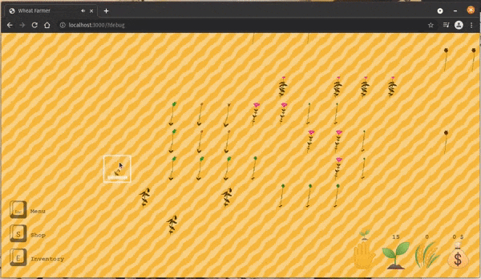

Wheat Farmer
===

Farming/Tower Defense web-based game, written in TypeScript. Rendering on HTML Canvas.

**[Live demo (desktop-only)](https://360-noscope.de/wheat-farmer)**



# Table of contents
1. [The Game](#1-the-game)
1. [Dependencies](#2-dependencies)
2. [Installation](#3-installation)
3. [Usage](#4-usage)
4. [Copyright](#5-copyright)

# 1. The Game
**The game is currently at early alpha developing stage**, meaning it is neither complete, nor bug-free.

**Implemented mechanics:**
- Gather wheat by planting seeds and waiting on your crops to grow, harvesting them upon completion ✅ 
- Avoid hostile robot attacks while farming ✅

**Road map:**
* Sell harvested wheat for currency ❌
* Trade currency for armed defenses ❌
* Automate farming by upgrading technology ❌

# 2. Dependencies
* [Node.js](https://nodejs.org)

# 3. Installation
```bash
$ npm install --global yarn
$ yarn install
```

# 4. Usage
```bash
$ yarn build # Build once
$ yarn develop # Build once and watch afterwards - (Re-)starts Express webserver and BrowserSync
$ yarn production # Build in production mode (Compress everything, strip debug)ya
$ yarn start # Start Express webserver to serve files on http://localhost:3000
$ yarn lint # Run ESLint on TypeScript code
```

# 5. Third-party contents
* [GameLoop.js](https://gist.github.com/niklaskorz/2ef312693977e02d3fb4751b28f7d435) by [Niklas Korz](https://gist.github.com/niklaskorz)
* [OpenMoji](https://openmoji.org/)